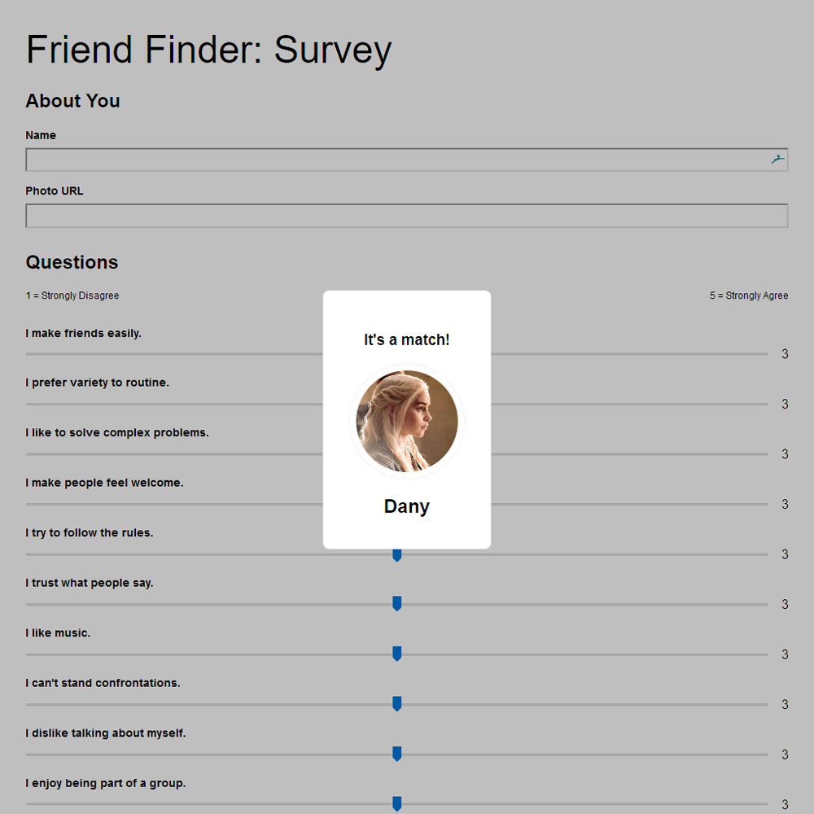

# FriendFinder
An app that will match you with like-minded and similar personality traits as you!



## Launch App
https://mighty-hamlet-49777.herokuapp.com/

## Process
I used a spreadsheet and used **=RANDBETWEEN(_bottom_, _top_)** method to generate a set of random scores, where _bottom_ denotes the minimum (in this case, 1) and _top_ is the ceiling (5). I used fill down and across to get the right around (10). I then export the spreadsheet into a csv file and assigned names per set of scores.

## Notable NPM packages
- body-parser
- express
- path
- serve-favicon

## Determining A Match
To determine the user's most compatible friend, we use the following as a guide:

- Convert each user's results into a simple array of numbers:
```javascript
let scores = [5, 1, 4, 4, 5, 1, 2, 5, 4, 1]
```
- Compare the difference between current user's scores against those from other users, question by question. Add up the `differences` to calculate the `totalDifference`.
  - User 1 `[5, 1, 4, 4, 5, 1, 2, 5, 4, 1]`
  - User 2 `[3, 2, 6, 4, 5, 1, 2, 5, 4, 1]`
  - Total Difference: 2 + 1 + 2 = 5
- Use the absolute value of the differences. For example, calculations for both `5-3` and `3-5` should equal to `2`
- The closest match will be the user with the least amount of difference.
